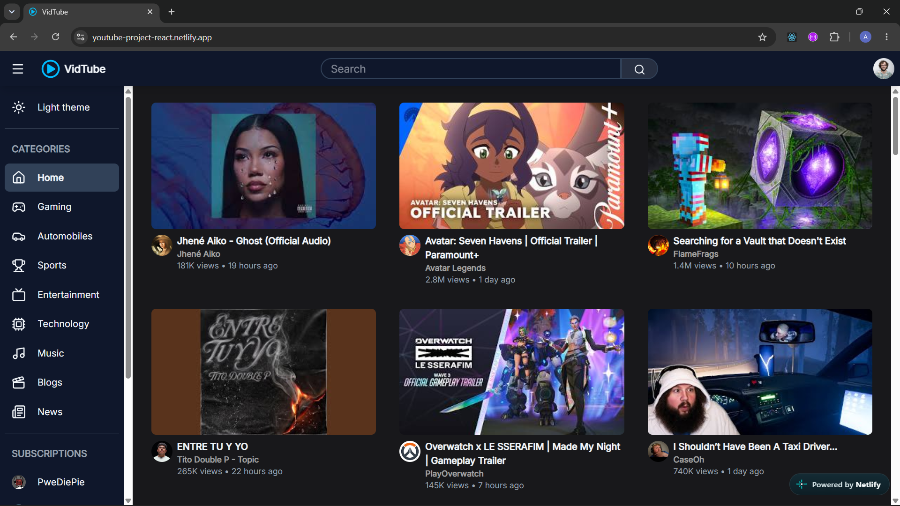
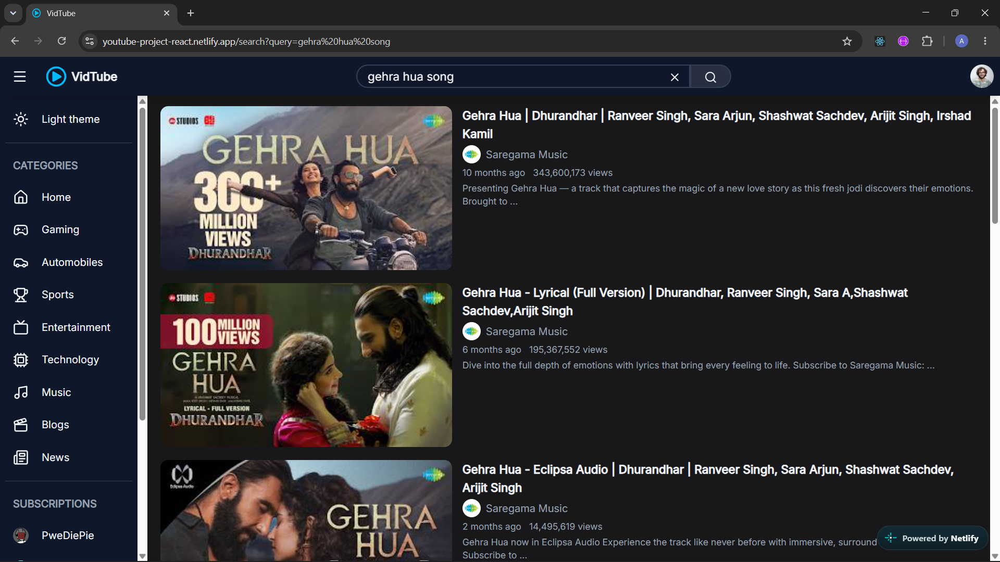
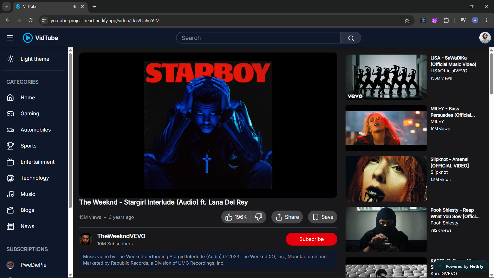
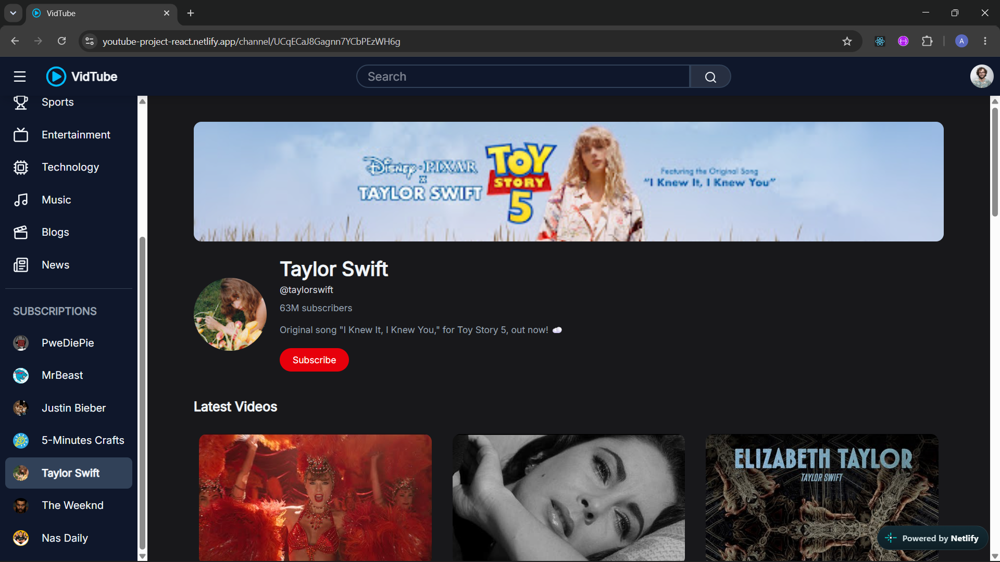

# YouTube Clone

A responsive YouTube-inspired web application built with **React.js**, **JavaScript**, **Tailwind CSS**, and the **YouTube Data API**.

The project focuses on recreating the core browsing and video-watching experience of YouTube while practicing React components, state management, API integration, routing, responsive design, and reusable UI.

## Live Demo

[View Live Demo](https://youtube-project-react.netlify.app/)

## Preview

### Home



### Search



### Video



### Channel



## Features

* Browse popular videos by category
* Search for videos
* View video details
* Watch videos using the YouTube player
* View recommended videos
* Browse individual channel pages
* View comments
* Responsive layout for different screen sizes
* Dark mode
* Loading skeletons
* Client-side routing
* API error handling and empty-result handling

## Tech Stack

* **React.js** — UI development
* **JavaScript (ES6+)** — Application logic
* **Tailwind CSS** — Styling and responsive design
* **React Router** — Client-side routing
* **YouTube Data API** — Video, channel, search, and comment data
* **Vite** — Development and build tooling

## API Integration

The application uses the **YouTube Data API v3** to retrieve:

* Popular videos
* Search results
* Video statistics and details
* Channel information
* Playlist videos
* Comments

The application also combines data from different API endpoints to enrich the displayed video and search results.

## Project Structure

```text
src/
├── assets/
├── components/
│   ├── Navbar/
│   ├── VideoPage/
│   ├── Feed.jsx
│   ├── Overlay.jsx
│   ├── ScrollTop.jsx
│   └── Sidebar.jsx
├── data/
├── pages/
│   ├── Channel.jsx
│   ├── Home.jsx
│   ├── Search.jsx
│   └── Video.jsx
├── skeletons/
│   ├── VideoSkeleton/
│   ├── ChannelSkeleton.jsx
│   ├── HomeSkeleton.jsx
│   └── SearchSkeleton.jsx
├── utils/
│   ├── formatNumber.js
│   └── timeAgo.js
├── App.jsx
├── index.css
└── main.jsx
```

## Getting Started

### 1. Clone the repository

```bash
git clone https://github.com/AniketLohkare/Youtube-Clone-Project.git
```

### 2. Navigate to the project

```bash
cd Youtube-Clone-Project
```

### 3. Install dependencies

```bash
npm install
```

### 4. Add your YouTube API key

Create a `.env` file in the project root:

```env
VITE_YOUTUBE_API_KEY=your_api_key
```

### 5. Start the development server

```bash
npm run dev
```

The application will be available at the local development URL provided by Vite.

## What I Learned

Through this project, I practiced:

* Building reusable React components
* Managing component state with React Hooks
* Fetching and handling data from external APIs
* Working with asynchronous JavaScript
* Handling loading, error, and empty states
* Implementing client-side routing
* Passing data between components
* Creating responsive layouts with Tailwind CSS
* Working with URL parameters and search queries
* Structuring a React application into reusable features

## Challenges

One of the main challenges was working with multiple YouTube API endpoints and combining their responses into the data required by the UI.

For example, search results provide basic video information, so additional requests are used to retrieve video statistics and channel information before displaying the final results.

## Future Improvements

* Improve API request cancellation and stale-response handling
* Further improve accessibility of interactive controls
* Add more robust API fallback handling
* Improve the video/channel data loading flow
* Add additional user interactions

## Author

**Aniket Lohkare**

[GitHub](https://github.com/AniketLohkare) · [LinkedIn](https://www.linkedin.com/in/aniketlohkare/)
